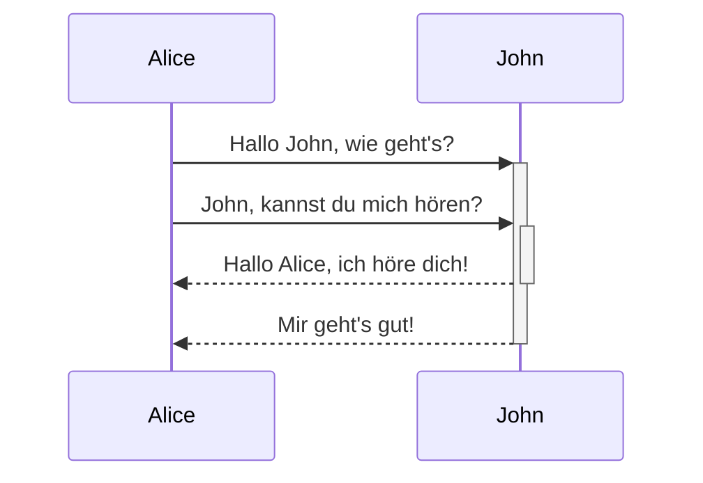
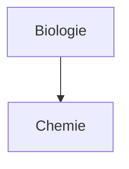

---
aliases:
  - Markdown für Fortgeschrittene
permalink: erweiterte-syntax
publish: true
---

Erfahre, wie du fortgeschrittene Formatierungstechniken in deinen Notizen anwendest.

## Tabellen

Du kannst Tabellen erstellen, indem du senkrechte Striche (`|`) zur Darstellung von Spalten verwendest und Bindestriche (`-`), um Überschriften zu definieren. Hier ein Beispiel:

```md
| Vorname    | Nachname  |
| ---------- | --------- |
| Max        | Planck    |
| Marie      | Curie     |
```

| Vorname | Nachname |
| ------- | -------- |
| Max     | Planck   |
| Marie   | Curie    |

Die senkrechten Striche an den Seiten der Tabelle sind optional, erhöhen aber die Lesbarkeit.

> [!tip] In der *Live-Vorschau* kannst du mit Rechtsklick in die Tabelle ein Kontextmenü öffnen, über das sich Zeilen und Spalten hinzufügen oder löschen lassen. Zudem stellt das Kontextmenü Sortierfunktionen zur Verfügung.

Du kannst eine Tabelle einfügen über den Befehl **Tabelle einfügen** aus der [[Befehlspalette|Befehlspalette]] oder per Rechtsklick und Auswahl von **Einfügen** → **Tabelle**. Auf diese Weise erhältst du eine einfache, bearbeitbare Tabelle:

```md
|     |     |
| --- | --- |
|     |     |
```

Beachte, dass die Zellen im Bearbeitungsmodus nicht perfekt ausgerichtet sein müssen, lediglich die Kopfzeile muss mindestens zwei Bindestriche je Zelle enthalten:

```md
Vorname | Nachname
-- | --
Max | Planck
Marie | Curie
```


### Formatierung innerhalb einer Tabelle

Du kannst die [[Formatierungsgrundlagen|einfachen Formatierungstechniken]] verwenden, um Inhalte in einer Tabelle zu gestalten.

| Erste Spalte       | Zweite Spalte                                         |
| ------------------ | ----------------------------------------------------- |
| [[Interne Links]] | Verlinkung einer Datei *innerhalb* deines **Vaults**. |
| [[Dateien einbetten]]    | ![[Engelbart.jpg\|100]]                               |
 
> [!note] Vertikale Striche innerhalb einer Tabelle
> Wenn du bspw. [[Aliasse|Aliasse]] verwenden oder [[Formatierungsgrundlagen#Externe Bilder|Bildgrößen anpassen]] möchtest innerhalb einer Tabelle, musst du vor den vertikalen Strich jeweils einen Backslash (`\`) setzen, damit dieser nicht als Spaltentrenner interpretiert wird.
>
> ```md
> Erste Spalte | Zweite Spalte
> -- | --
> [[Formatierungsgrundlagen\|Markdown Syntax]] | ![[Engelbart.jpg\|200]]
> ```
>
> Erste Spalte | Zweite Spalte
> -- | --
> [[Formatierungsgrundlagen\|Markdown Syntax]] | ![[Engelbart.jpg\|200]]

Text in Spalten lässt sich mit Hilfe der Doppelpunkt-Syntax (`:`) in der Kopfzeile ausrichten. In der *Live-Vorschau* kannst du Tabelleninhalte auch über das Kontextmenü ausrichten.

```md
Linksbündig | Zentriert | Rechtsbündig
:-- | :--: | --:
Inhalt | Inhalt | Inhalt
```

| Linksbündig | Zentriert | Rechtsbündig |
| :---------- | :-------: | -----------: |
| Inhalt      |  Inhalt   |       Inhalt |

## Diagramme

Mit [Mermaid](https://mermaid-js.github.io/) kannst du deinen Notizen sogar Diagramme hinzufügen. Mermaid unterstützt eine Reihe von Diagrammtypen, wie z.B. [Flussdiagramme](https://docs.min87.com/de/mermaid/syntax/flowchart.html), [Sequenzdiagramme](https://docs.min87.com/de/mermaid/syntax/sequenceDiagram.html) oder [Zeitstrahlen](https://docs.min87.com/de/mermaid/syntax/timeline.html).

> [!tip]
> Du kannst im [Live Editor](https://mermaid.live) mit Mermaid-Diagrammen experimentieren, bevor du sie in deine Notizen einbindest.

Um ein Mermaid-Diagramm einzufügen, erstelle einen `mermaid` [[Formatierungsgrundlagen#Quelltext-Blöcke|Quelltext-Block]].

````md

````


````md

````


### Dateien in Diagrammen verlinken

Du kannst [[Interne Links|Interne Links]] in Diagramme einbinden, indem du den jeweiligen Knoten die [Klasse](https://mermaid.js.org/syntax/flowchart.html#classes) `internal-link` zuweist.

````md

````


> [!note] Hinweis
> Interne Links in Diagrammen erscheinen nicht in der [[Graph-Ansicht]].

Wenn du Diagramme mit vielen Knoten hast, kannst du das folgende Code-Beispiel verwenden.

````md

````

Auf diese Weise wird jeder Buchstabenknoten zu einem internen Link mit dem [Knotentext](https://docs.min87.com/de/mermaid/syntax/flowchart.html#ein-knoten-mit-text) als Linktext.

> [!note]
> Enthalten die Namen deiner Notizen Sonderzeichen, musst du diese Namen in doppelte Anführungszeichen setzen.
>
> ```
> class "⨳ Sonderzeichen" internal-link
> ```
>
> Oder `A["⨳ Sonderzeichen"]`.

Erfahre mehr über das Erstellen von Diagrammen in der [offiziellen Mermaid Dokumentation](https://docs.min87.com/de/mermaid/intro/).

## Mathematische Ausdrücke

Mit [MathJax](http://docs.mathjax.org/en/latest/basic/mathjax.html) und der LaTex-Notation kannst du auch mathematische Ausdrücke in deinen Notizen verwenden.

Um einen MathJax-Ausdruck einzufügen, umschließe diesen innerhalb eines Quelltext-Blockes mit doppelten Dollarzeichen (`$$`).

```md
$$
\begin{vmatrix}a & b\\
c & d
\end{vmatrix}=ad-bc
$$
```

$$
\begin{vmatrix}a & b\\
c & d
\end{vmatrix}=ad-bc
$$

Mathematische Ausdrücke innerhalb eines Absatzes werden mit einfachen Dollarzeichen `$` umschlossen.

```md
Das ist ein mathematischer Ausdruck innerhalb eines Absatzes: $e^{2i\pi} = 1$.
```

> Das ist ein mathematischer Ausdruck innerhalb eines Absatzes: $e^{2i\pi} = 1$.

Weitere Informationen über die Syntax findest du unter [MathJax basic tutorial and quick reference](https://math.meta.stackexchange.com/questions/5020/mathjax-basic-tutorial-and-quick-reference).

Eine Reihe von unterstützten MathJax Packages findest du in der [TeX/LaTeX Extension List](http://docs.mathjax.org/en/latest/input/tex/extensions/index.html).
