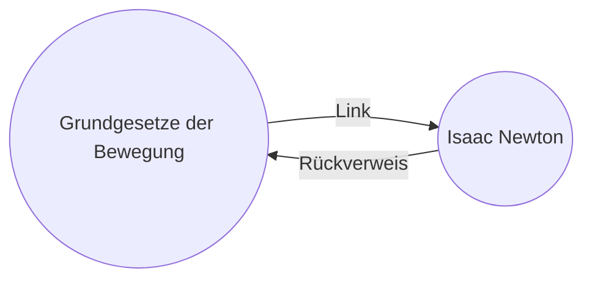

---
aliases:
  - Gewusst wie/Verwendung von Rückverweisen
permalink: plugins/rueckverweise
---

 Die [[Standarderweiterungen|Standarderweiterung]] *Rückverweise* zeigt dir alle Rückverweise auf die aktive Notiz an.

Ein Rückverweis ist ein Link von einer anderen auf die aktive Notiz. Im folgenden Beispiel enthält die Notiz "Grundgesetze der Bewegung" einen Link zur Notiz "Isaac Newton". Der entsprechende Rückverweis würde von "Isaac Newton" zurückführen zu "Grundgesetze der Bewegung".

Rückverweise helfen dir, Notizen zu finden, die auf deine aktuell bearbeitete Notiz verweisen. Stell dir vor, du könntest die Rückverweise auf jede Webseite im Internet auflisten.

## Rückverweise-Ansicht

Die Rückverweise-Ansicht listet alle Rückverweise für die jeweils aktive Notiz auf. Die Übersicht enthält zwei einklappbare Abschnitte:

-  **Verlinkte Erwähnungen** listet Notizen auf, die [[interne Links]] auf die aktive Notiz enthalten.
- **Nicht verlinkte Erwähnungen** listet Notizen auf, die den nicht verlinkten Titel der aktiven Notiz enthalten.

In der *Rückverweise-Ansicht* kannst du:

- **Ergebnisse einklappen** legt fest ob die Notizenliste erweitert wird, um die darin enthaltenen Erwähnungen im Detail anzuzeigen.
- **Mehr Kontext anzeigen** legt fest, ob der Absatz mit der Erwähnung vollständig oder gekürzt angezeigt wird.
- **Sortierreihenfolge ändern** lässt dich die Liste nach Dateiname, Bearbeitungs- oder Erstellungsdatum sortieren.
- **Suchfilter anzeigen** blendet ein Textfeld ein, über das du die Ergebnisliste [[Suche|filtern]] kannst.

## Rückverweise auf die aktive Notiz anzeigen

Um die *Rückverweise* für die aktive Notiz anzuzeigen, klicke auf den Tab **Rückverweise**
 ( ![[obsidian-icon-links-coming-in.svg#icon]] ) in der rechten [[Seitenleisten|Seitenleiste]].

> [!note] Hinweis
> Falls der Tab *Rückverweise* nicht vorhanden ist, kannst du ihn über die [[Befehlspalette]] mit dem Befehl **Rückverweise: Rückverweise anzeigen** einblenden.

## Rückverweise auf eine bestimmte Notiz anzeigen

Die *Rückverweise-Ansicht* listet die Rückverweise der aktiven Notiz auf und wird automatisch aktualisiert, wenn du zu einer anderen Notiz wechselst. Möchtest du die Rückverweise einer bestimmten Notiz sehen, auch wenn diese gerade nicht aktiv ist, kannst du eine *verlinkte* Rückverweise-Ansicht öffnen.

Um eine verlinkte Rückverweise-Ansicht zu öffnen:

1. Öffne über das Drei-Punkte-Menü ( ![[lucide-ellipsis-vertical.svg#icon]] ) in der aktiven Notiz das Kontextmenü.
2. Wähle **Verlinkte Ansicht öffnen → Rückverweise öffnen**.

Auf diese Weise öffnest du eine separate Registerkarte unterhalb deiner aktiven Notiz. Anhand des Link-Symbols rechts neben dem Titel der Notiz siehst du, dass die Registerkarte mit der Notiz verlinkt ist.

## Rückverweise innerhalb einer Notiz anzeigen

Anstatt die Rückverweise in einer separaten Registerkarte anzuzeigen, kannst du sie auch am Ende deiner Notiz anzeigen lassen. Es gibt verschiedene Möglichkeiten, Rückverweise innerhalb einer Notiz anzuzeigen.

**Befehlspalette**:

1. Öffne die [[Befehlspalette]].
2. Wähle **Rückverweise: Rückverweise im Dokument ein-/ausblenden**.

**Drei-Punkte-Menü**:

1. Öffne über das Drei-Punkte-Menü ( ![[lucide-ellipsis-vertical.svg#icon]] ) in der aktiven Notiz das Kontextmenü.
2. Wähle **Rückverweise im Dokument**.

**Erweiterungseinstellungen**:

1. Öffne die **Einstellungen** ( ![[lucide-settings.svg#icon]] ).
2. Aktiviere **Rückverweise am Ende einer Notiz anzeigen** unter **Obsidian-Erweiterungen → Rückverweise**.
