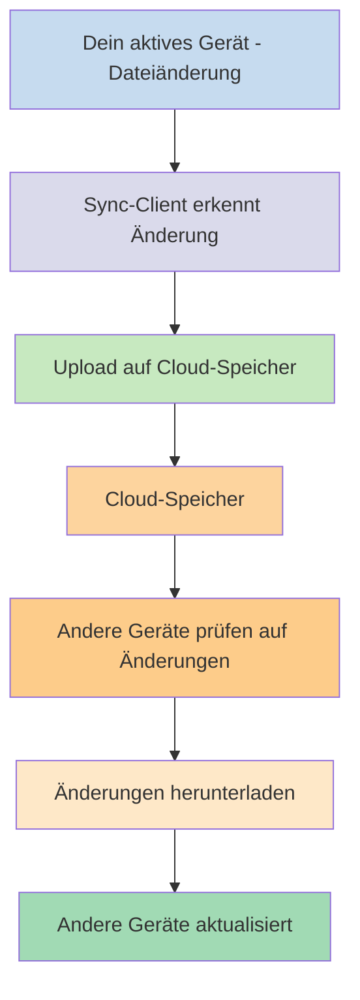
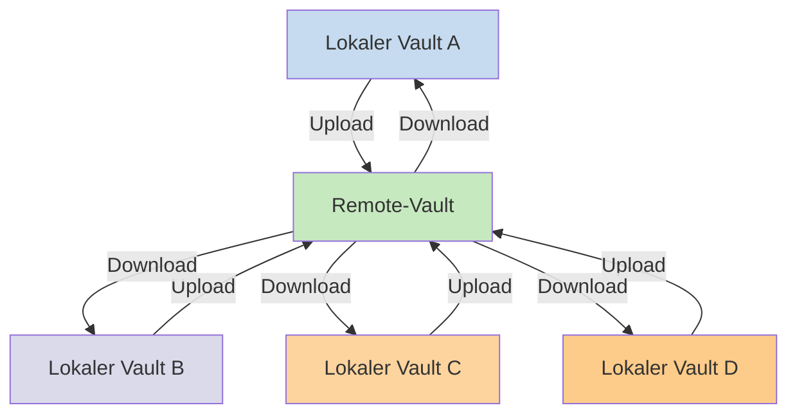

---
aliases:
  - Lokaler Vault
  - Remote-Vault
  - Remote-Vaults
  - Lokale Vaults
cssclasses:
  - soft-embed
description: Erfahre mehr über den Unterschied zwischen lokalen und Remote-Vaults in der Praxis. 
mobile: true
permalink: sync/vault-typen
publish: true
---

Wenn du deine Notizen auf verschiedenen Geräten verwenden möchtest, hast du z.B. die Möglichkeit, [[Synchronisiere Notizen zwischen Geräten|deine Notizen zwischen Geräten zu synchronisieren]]. Obsidian bietet dafür den Dienst [[Einführung in Obsidian Sync|Obsidian Sync]] an, der etwas anders funktioniert, als bekannte Synchronisierungsdienste wie [[Synchronisiere Notizen zwischen Geräten#iCloud|iCloud]] oder [[Synchronisiere Notizen zwischen Geräten#OneDrive|OneDrive]].

Einige Begriffe:

- Ein **Vault** ist ein Ordner in deinem Dateisystem, der Notizen und einen Ordner  `.obsidian` enthält mit der Obsidian-Konfiguration.
- Ein **lokaler Vault** ist eine Kopie deines Vaults, der auf jedem deiner Geräte existiert. Wenn du Synchronisierungsdienste verwendest, verbindest du diese lokalen Vaults, um die Synchronisierung zu aktivieren.
- Ein **Remote-Vault** ist ein zentraler Speicher, mit dem lokale Vaults über Obsidian Sync verbunden werden.

Es gibt zwei gebräuchliche Ansätze für die Synchronisierung:

- **[[#Dateibasierte Synchronisierungsdienste|Dateibasierte Synchronisierungsdienste]]**: Lokale Vaults sind dafür in überwachten Ordnern gespeichert, die Synchronisierung geschieht über das Dateisystem
- **[[#Obsidian Sync|Remote-Vaults]]**: Die Synchronisierung läuft über zentralisierten Speicher, mit dem lokale Vaults direkt über Obsidian Sync verbunden sind

## Dateibasierte Synchronisierungsdienste

Dienste wie Dropbox, Google Drive, iCloud oder OneDrive arbeiten dateibasiert. Diese Dienste überwachen bestimmte Ordner und synchronisieren automatisch alle Dateien, die sich darin befinden. Dateien müssen sich in den dafür vorgesehenen Cloud-Service-Verzeichnissen befinden, um synchronisiert zu werden. Wenn der Cloud-Dienst die Synchronisierung im Hintergrund ausführt, werden Dateien möglicherweise auch aktualisiert, wenn du die Anwendung gerade nicht verwendest, um die Dateien anzuzeigen.

Für dateibasierte Synchronisierungsdienste ist dein Vault einfach ein normaler Ordner wie jeder andere, der überwacht wird. Es gibt keinen speziellen Remote-Vault, stattdessen dient der Cloud-Speicher als eine Art Zwischenspeicher, um Dateien zwischen deinen lokalen Vaults auf verschiedenen Geräten zu kopieren.

Die Abbildung unten zeigt vereinfacht, wie diese Dienste funktionieren:

## Obsidian Sync

Mit Obsidian Sync kannst du einen Remote-Vault erstellen, der als zentraler Speicher dient für den [[Einführung in Obsidian Sync|Obsidian Sync]]-Dienst. Du kannst fast jeden Ordner auf deinem Gerät zum Speichern deiner Daten wählen, ob auf einem externen Laufwerk, auf dem Systemlaufwerk `C:\` oder im App-Speicher unter Android.

Wir haben dennoch eine Liste für empfohlene Speicherorte zusammengestellt, wenn du gleichzeitig [[#Dateibasierte Synchronisierungsdienste]] auf deinem Gerät verwendest - das sind hauptsächlich Verzeichnisse, die nicht von einem [[Umstellung auf Obsidian Sync#Verschiebe deinen Vault aus deinem Drittanbieter-Sync- oder Cloud-Speicher|Drittanbieter-Synchronisierungsdienst]] überwacht werden.

Unten siehst du eine vereinfachte Darstellung der Funktionsweise von Obsidian Sync:

Die Stärken dieses Systems zeigen sich am ehesten mit zunehmender Anzahl unterschiedlicher Gerätetypen. [[#Dateibasierte Synchronisierungsdienste]] können über unterschiedliche Betriebssysteme hinweg uneinheitlich implementiert sein und Mobilgeräte haben ihre eigenen Regeln hinsichtlich Sandboxing und Energiesparoptionen für Apps, was eine nahtlose Funktionsweise für herkömmliche dateibasierte Dienste zur Herausforderung machen kann.

Obsidian Sync führt die Synchronisierung direkt über die Anwendung durch und sorgt so für ein einheitliches Verhalten unabhängig vom Gerätetyp oder systembedingten Einschränkungen. Die Priorität liegt dabei immer in der Speicherung einer lokalen Kopie deiner Daten als [[Sichere deinen Vault|Soft-Backup]].

### Sync-Verhalten

Wenn du Dateien in deinem lokalen Vault bearbeitest, erkennt Obsidian Sync die Änderungen und lädt diese in den Remote-Vault hoch. Andere Geräte, die mit demselben Remote-Vault verbunden sind, laden die Änderungen herunter und wenden sie dort auf deinen lokalen Vault an. Obsidian Sync überwacht Änderungen auf Dateiebene und überträgt nur geänderte Dateien, anstatt ganze Ordner. Das reduziert die Netzwerkauslastung und Übertragungszeiten.

Falls Konflikte auftreten oder wenn du steuern musst, welche Dateien synchronisiert werden, bietet Obsidian verschiedene Möglichkeiten:

![[Obsidian Sync/Fehlerbehandlung#Auflösen von Konflikten|Conflict resolution]]

![[Konfiguration und selektive Synchronisierung#Selective syncing#Exclude a folder from syncing]]

### Offline-Verhalten

Änderungen im Offline-Betrieb werden in eine Warteschlange gestellt und automatisch synchronisiert, sobald sich dein Gerät wieder mit dem Internet verbindet und Obsidian geöffnet ist.
Dein lokaler Vault bleibt auch im Offline-Betrieb voll funktionsfähig.

## Nächste Schritte

- [[Obsidian Sync einrichten]] für eine Einführung in Remote-Vaults.
- [[Umstellung auf Obsidian Sync]], wenn von deiner derzeitigen dateibasierten Lösung zu Obsidian Sync wechseln möchtest.
- [[Synchronisiere Notizen zwischen Geräten|Erkunde andere Optionen]], wenn du noch unentschieden bist.
